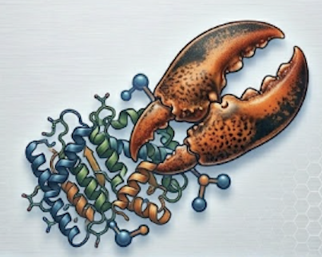

# ProteinClaw



### Agentic CLI for protein binder design.
#### Describe a protein in plain English; get back a ranked set of binder candidates with structures, sequences, and an interactive HTML report.
---

## What it does

`proteinclaw run "design a 60–90 residue binder to PD-L1's IgV domain"` runs this pipeline autonomously on your local GPU workstation:

```
Hermes agent  →  RFdiffusion3  →  ProteinMPNN  →  ESMFold  →  AlphaFold2-multimer
                 (backbones)      (sequences)    (pre-filter) (complex ranking)
```

The agent picks the target structure, hotspots, length range, and sampling hyperparameters from your prompt. It pre-filters non-folding designs with ESMFold (cheap, monomer), then ranks the survivors by **AF2-multimer complex pLDDT averaged over the binder chain** — the signal that actually correlates with binding.

You get back: ranked PDBs + FASTAs, an HTML report (rank table, ESM vs AF2 scatter, 3D viewer), and a full `trace.jsonl` of every agent decision.

---

## Why it exists

Binder-design pipelines are usually a stack of YAML configs, shell scripts, and manual triage. `proteinclaw` collapses that into one English sentence. The agent does the literature scan, structure fetch, epitope selection, model/hyperparam choice, execution, and triage — and logs every decision so the run is fully auditable.

**It is an internal research tool**, optimized for fast iteration on a single local GPU box. No SLURM, no cloud, no wet-lab output (yet).

---

## Hardware requirements

| | Minimum | Recommended |
|---|---|---|
| GPU | 1× NVIDIA, 24 GB VRAM (RTX 3090 / A10G / L4) | 1× A100 or H100, 40–80 GB |
| RAM | 32 GB | 64 GB |
| Disk | 200 GB free | 500 GB |
| OS | Linux + NVIDIA drivers + Docker + NVIDIA Container Toolkit | same |

At 24 GB, AF2-multimer fits for complexes <400 residues. Larger targets need 40+ GB.

---

## Install + first run

End-to-end setup on a GPU box (Lambda Labs A100 40 GB is the reference VM; see [SETUP.md](./SETUP.md) for the full Lambda-specific recipe).

> **Step 0 — GPU + Docker prerequisites (bare Ubuntu 24.04).** Fresh cloud VMs
> (Lambda included) often come up with **no NVIDIA driver and no Docker** — `proteinclaw doctor`
> will FAIL `gpu`/`docker`/`nvidia-ctk` until these are installed. The pipeline runs every model
> via `docker run --gpus all`, so all three are required. Verified bring-up on Ubuntu 24.04 + A10:
>
> ```bash
> # NVIDIA driver (580 = stable for CUDA 12/13; noninteractive avoids the debconf prompt)
> sudo DEBIAN_FRONTEND=noninteractive NEEDRESTART_MODE=a apt-get update
> sudo DEBIAN_FRONTEND=noninteractive NEEDRESTART_MODE=a apt-get install -y \
>     nvidia-driver-580-server nvidia-utils-580-server
> sudo modprobe nvidia nvidia_uvm nvidia_drm     # DKMS builds vs the running kernel; no reboot
> nvidia-smi                                      # should list your GPU
>
> # Docker
> sudo apt-get install -y docker.io
> sudo usermod -aG docker $USER                   # NOTE: does not apply to the current shell —
>                                                 # open a new SSH session, or prefix one-off
>                                                 # commands with `sg docker -c '...'`
>
> # NVIDIA Container Toolkit (lets containers see the GPU)
> curl -fsSL https://nvidia.github.io/libnvidia-container/gpgkey \
>   | sudo gpg --dearmor -o /usr/share/keyrings/nvidia-container-toolkit-keyring.gpg
> curl -s -L https://nvidia.github.io/libnvidia-container/stable/deb/nvidia-container-toolkit.list \
>   | sed 's#deb https://#deb [signed-by=/usr/share/keyrings/nvidia-container-toolkit-keyring.gpg] https://#g' \
>   | sudo tee /etc/apt/sources.list.d/nvidia-container-toolkit.list
> sudo apt-get update && sudo apt-get install -y nvidia-container-toolkit
> sudo nvidia-ctk runtime configure --runtime=docker && sudo systemctl restart docker
>
> # Verify GPU passthrough into a container
> sudo docker run --rm --gpus all nvidia/cuda:12.4.1-base-ubuntu22.04 nvidia-smi
> ```
>
> If `proteinclaw`/`docker` give a permission error right after `usermod`, your shell hasn't picked
> up the `docker` group yet — start a fresh login or wrap the call: `sg docker -c 'bash -c "source .venv/bin/activate && proteinclaw doctor"'`.

```bash
# 1. Get the code + install in a venv.
curl -LsSf https://astral.sh/uv/install.sh | sh   # if `uv` isn't already installed
git clone https://github.com/Daanish-Hindustani/ProteinClaw.git
cd ProteinClaw
uv venv && source .venv/bin/activate
uv pip install -e ".[dev]"

# 2. Guided setup — checks Hermes/provider auth, Docker, the NVIDIA
#    Container Toolkit, then runs doctor.
proteinclaw setup                             # nothing installs without confirmation

#    …or do it by hand (OpenRouter path, recommended):
#    export OPENROUTER_API_KEY=...
#    # optional: set HERMES_HOME if you keep Hermes config outside its default
#    # default is ~/.hermes on Linux, %LOCALAPPDATA%\hermes on Windows

# 3. Verify the environment.
proteinclaw doctor                            # all checks must PASS

# 4. Run.
proteinclaw run "design a 60-80 residue binder to PD-L1's IgV domain" \
    --output-dir ./runs

# 5. Browse history + open the report.
proteinclaw history
proteinclaw show <run_id>                     # opens report.html
```

`proteinclaw doctor` must pass before `proteinclaw run` is allowed (override only for dev with `--skip-doctor`). Model weights download lazily on first use into `~/.cache/{huggingface,rfdiffusion,openfold}` and persist across runs.

### Auth: Hermes provider credentials

ProteinClaw now runs through `hermes-agent`, not the Claude Agent SDK. You need a provider credential that Hermes can use:

- **OpenRouter path (recommended default):** export `OPENROUTER_API_KEY=...` and keep the default model (`anthropic/claude-sonnet-4.6`) or pass `--model`.
- **Direct provider path:** export `ANTHROPIC_API_KEY`, `OPENAI_API_KEY`, `GROQ_API_KEY`, `TOGETHER_API_KEY`, or another provider key supported by your Hermes config.
- **Hermes config path:** put provider config in `$HERMES_HOME/config.yaml` or `$HERMES_HOME/.env`. Hermes honors `HERMES_HOME`; otherwise it uses `~/.hermes` on Linux and `%LOCALAPPDATA%\hermes` on Windows.

`proteinclaw doctor` checks that `hermes-agent` is importable and that one of these auth paths exists. Provider billing follows the provider/key you configure; there is no Claude subscription/OAuth path in this integration.

---

## CLI surface

```bash
proteinclaw setup                      # guided first-run: login + Docker/GPU checks + doctor
proteinclaw run "<prompt>" [--rounds N=12] [--no-cap] [--max-turns N=60] [--output-dir PATH]
                           [--model ID] [--research-fanout/--no-research-fanout]
                           [--dry-run] [--show-reasoning] [--skip-doctor]
proteinclaw history [--limit N] [--target X]
proteinclaw show <run_id>              # opens report.html
proteinclaw cancel <run_id>            # stop an in-flight run (kills its containers + driver)
proteinclaw skills diff|log|reset|check  # review/validate/revert the agent's self-evolution skill edits
proteinclaw doctor [--self-test]       # --self-test runs the full tool-level suite
```

`--rounds` defaults to 12 (the agent stops early when its quality gate is met); `--no-cap` lets it self-pace. There is no `--max-designs` flag — the agent sizes each batch itself.

The only mid-run interruption is when target resolution is genuinely ambiguous (multiple isoforms / unrelated PDB structures) — the agent asks **one** clarifying question with a numbered menu. Otherwise it proceeds on best-guess and logs every assumption.

---

## What's in the box

```
runs/<run_id>/
  designs/
    rank_01_<id>.pdb
    rank_01_<id>.fasta
    ...
  report.html              # interactive: rank table (+ interface metrics), 3D viewer, run-activity timeline (debate · pipeline · self-evolution), reasoning
  plan.md                  # agent's run notebook: reasoning, scout hypotheses, debate log, design hypothesis
  trace.jsonl              # every prompt, tool call, decision, error
  literature.md            # papers / web findings the agent used
  config/                  # configs the agent generated per stage
  raw/                     # raw model outputs (reproducibility)
```

Plus a row in `~/.proteinclaw/runs.db` (SQLite).

---

## Architecture in one paragraph

A Hermes agent (`run_agent.AIAgent`) dispatches ProteinClaw tools registered into Hermes toolsets. Domain tools are split into a privileged `proteinclaw` toolset for design/analysis and a read-only `proteinclaw_research` toolset for scouts; Hermes native `web` and `skills` toolsets provide web search and `skill_manage` self-evolution. GPU-heavy models dispatch out to **local Docker containers** via a `ComputeRouter` → `LocalRunner` chain. Every GPU tool follows a strict **4-file convention** (`tool.yaml`, `Dockerfile`, `implementation.py`, `tool_entrypoint.py`) — adding a new model is one directory, no other edits. Tools share state through a per-run **session workspace** mounted at `/workspace` in every container, and pass *paths* (never multi-MB PDB bytes) through the LLM context.

Full details in [ARCHITECTURE.md](./ARCHITECTURE.md). Normative spec in [PRD-proteinclaw.md](./PRD-proteinclaw.md) §9.

---

## Project docs

| Doc | Purpose |
|---|---|
| [PRD-proteinclaw.md](./PRD-proteinclaw.md) | Normative spec (v1.0.0). When other docs disagree, the PRD wins. |
| [ARCHITECTURE.md](./ARCHITECTURE.md) | How the pieces fit together and why. |
| [PLAN.md](./PLAN.md) | Modular task breakdown — implementation, tests, success criteria, manual test per task. |
| [SETUP.md](./SETUP.md) | Lambda Labs VM setup for development (A100, persistent FS, Claude Code over SSH+tmux). |
| [NOTES.md](./NOTES.md) | Append-only cross-session engineering notebook — fixes, gotchas, pinned versions. |
| [CLAUDE.md](./CLAUDE.md) | Guidance for Claude Code when working in this repo. |

---

## Design principles (load-bearing)

- **Fail fast and loud.** No silent fallbacks to degraded pipelines. Three deliberate graceful-degradation paths exist (literature rate-limit, web scrape failure, ColabFold timeout → single-sequence MSA) and they all log loudly.
- **Rank by the complex, not the monomer.** AF2-multimer complex pLDDT over the binder chain is the ranking signal. ESMFold is a cheap pre-filter only. Interface-quality metrics (`ipSAE`, `ipTM`, `pDockQ`, `LIS` — via Dunbrack's `ipsae.py`) are also surfaced per design so the agent can tell a binder that merely folds from one with a confident interface.
- **Paths, not bytes.** PDBs never cross the LLM context. Tools write to `/workspace/<tool>_<step>/` and return paths.
- **The skill files are the agent.** `proteinclaw/skills/proteindesign.md` (core) is concatenated into the system prompt every run; per-tool detail in `skills/tools/<tool>.md` is read on demand (progressive disclosure). Repo files seed active Hermes skills under `$HERMES_HOME/skills/proteinclaw`; the agent may use Hermes `skill_manage` to append durable lessons (review with `proteinclaw skills diff`).
- **One directory per model.** No edits to the registry, router, or agent when adding a new tool.
- **The trace is the reproducibility artifact.** No `--seed` flag — Hermes/model plans are non-deterministic by design. `trace.jsonl` is what you keep.

---

## Status & roadmap

**v1 (in progress):** the pipeline above, single local GPU, natural-language input only. AF2 complex pLDDT is the ranking signal; interface-quality metrics (ipSAE / ipTM / pDockQ / LIS + deterministic biopython interface QC) are surfaced per design and feed a strict multi-metric "hit" gate the agent uses to decide when to stop.

**Explicitly deferred to v2+:** additional input modalities (PDB upload, UniProt ID, hotspot spec), AlphaFold DB target fallback, SLURM / cloud backends, Rosetta ddG (the one literature-validated discriminator — needs a PyRosetta CPU container + non-commercial license), DNA / wet-lab output, AF3 / Boltz / Chai, LigandMPNN, RFdiffusion-AA.

See [PRD-proteinclaw.md §13](./PRD-proteinclaw.md) for the full deferral list.

---

## Troubleshooting

Issues hit in real runs (see [NOTES.md](./NOTES.md) for the full set with fix detail):

| Symptom | Likely cause | Fix |
|---|---|---|
| `doctor` reports `hermes-agent FAIL` | `hermes-agent` / `model_tools` not importable | Reinstall deps: `uv pip install -e ".[dev]"` |
| `doctor` reports `hermes-auth FAIL` | No provider key and no Hermes config | `export OPENROUTER_API_KEY=...` or configure `$HERMES_HOME/config.yaml` / `$HERMES_HOME/.env` |
| `docker: permission denied` | User not in `docker` group | `sudo usermod -aG docker $USER && newgrp docker`, or `sg docker -c '...'` for a one-off |
| RFD3 builds but `Permission denied: '/usr/local/lib/python3.9/dist-packages/schedules'` | Container UID 1000 can't write inside the image | Already patched in our Dockerfile (creates `schedules/` 0777) — make sure you're on `proteinclaw/rfdiffusion3:0.1.0` from this repo |
| `ESMFold: failed to load checkpoint — torch.load vulnerability` | Pinned torch < 2.6 | Already patched (image pins torch 2.6.0+cu124); rebuild image |
| AF2-multimer `CUDNN_STATUS_INTERNAL_ERROR` | cuDNN 9 vs cuDNN 8 mismatch (jax 0.4.23 wants cuDNN 8) | Already patched (image based on `nvidia/cuda:12.2.2-cudnn8-runtime-ubuntu22.04`); rebuild |
| `proteinclaw run` fails during `AIAgent` construction with missing provider credentials | Hermes cannot find a provider key/config | Confirm `OPENROUTER_API_KEY` is in the same shell, or set `HERMES_HOME` to the config profile you intend |
| Agent calls a tool with the wrong path and the tool fails | Older `agent/mcp_tools.py` without session+path translation | Pull head of `development`; commit `3f926f4` or later injects `session_id` and rewrites host→container paths automatically |
| `proteinclaw history` returns "(no runs found)" | DB at `~/.proteinclaw/runs.db` was created by an older code path | Delete + re-run; DB schema is auto-migrated on every open |
| Run is slow / costs more than expected | First-call ESMFold downloads ~14 GB; first-call AF2 downloads ~5 GB OpenFold params | Both cache to `~/.cache/{huggingface,openfold}`. Subsequent runs reuse |
| `report.html` opens but no Mol* viewer | Browser blocked the CDN load (`cdn.jsdelivr.net`) | Allow `cdn.jsdelivr.net` in the page or open the underlying PDB (`designs/rank_01_*.pdb`) in PyMOL/ChimeraX |

For unknown errors, always check `trace.jsonl` in the run dir — every tool call's input + result envelope is recorded line by line.

## Security

`proteinclaw` runs an **autonomous Hermes agent with shell access** on the machine you launch it from. The agent fetches **untrusted external content** (web search, literature, PDB files) as part of normal operation. That combination means a prompt-injection payload in fetched content could, in principle, steer the agent into running arbitrary commands on the host.

There is **no in-process sandbox** guarding against this, by design: with an unrestricted shell available, an in-process Python restriction would enforce nothing (the [ARCHITECTURE.md §9.5](./ARCHITECTURE.md) threat model explains why). The real isolation boundaries are the per-invocation **Docker containers** the GPU models run in, and the **host OS / VM** itself.

**So: run it on a dedicated GPU box or a disposable VM — not on a workstation holding secrets or production credentials.** This matches the intended use (a single-user local research tool); it is not hardened for shared or hostile multi-tenant environments.

Credentials: provider keys live in your shell environment or Hermes config (`$HERMES_HOME/config.yaml` / `.env`); they are not logged. Never paste API keys or tokens into the agent prompt.

---

## License

[MIT](./LICENSE) © 2026 Daanish Hindustani.

The pipeline shells out to third-party models (RFdiffusion3, ProteinMPNN, ESMFold, ColabFold/AlphaFold2) and Dunbrack's `ipsae.py`, each under its own upstream license — review those before any commercial or redistribution use.
